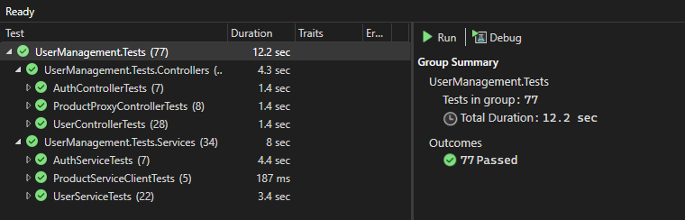
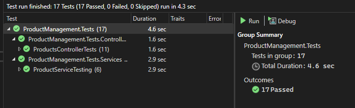
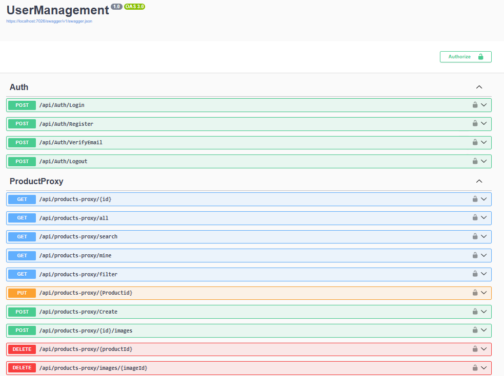
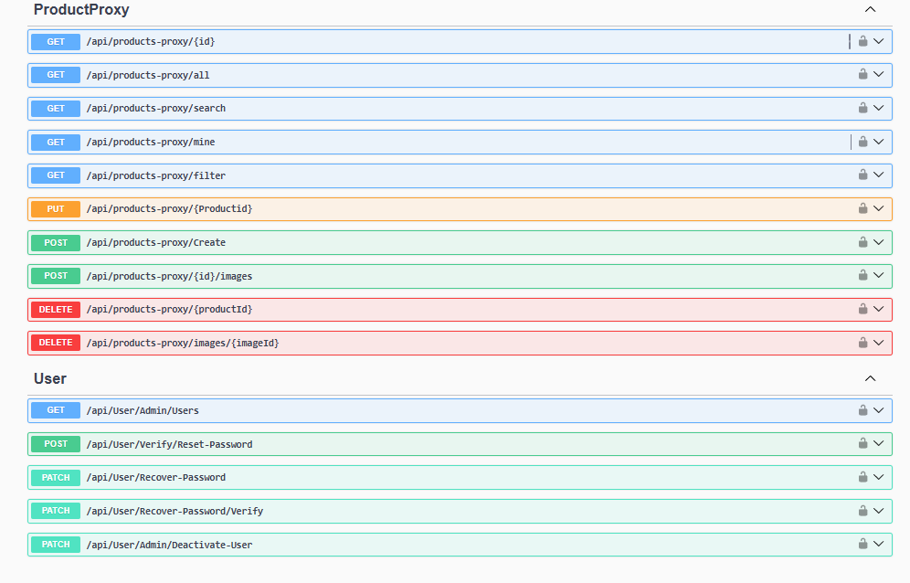
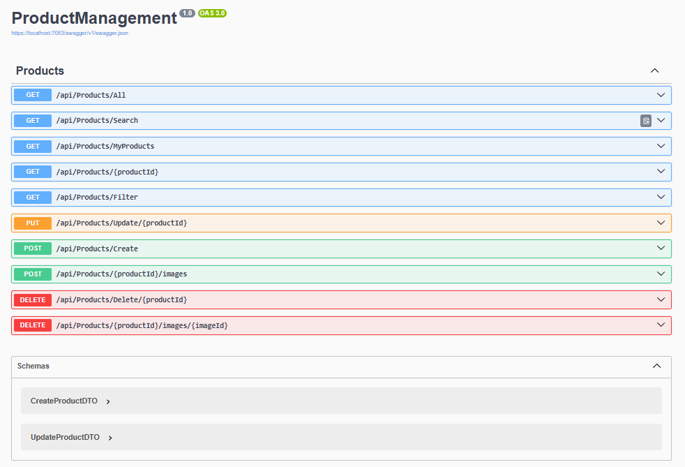

# Product and User Management Microservices

A robust, scalable microservices-based web API system built with ASP.NET Core for managing users and products with comprehensive authentication, authorization, and file management capabilities.

##  Architecture

This project implements a **Monolith-style Microservices Architecture** with two independent services that communicate via RESTful APIs:

- **User Management Service**: Handles authentication, authorization, user operations, and email notifications
- **Product Management Service**: Manages product CRUD operations, image uploads, filtering, and pagination

```
┌─────────────────────────────────────┐
│   User Management Microservice      │
│                                      │
│  ┌──────────────────────────────┐  │
│  │   Controllers                 │  │
│  └──────────────┬────────────────┘  │
│                 │                    │
│  ┌──────────────▼────────────────┐  │
│  │   Services Layer              │  │
│  │  - Auth Service               │  │
│  │  - User Service               │  │
│  │  - Email Service (SMTP)       │  │
│  │  - HTTP Client Service  ──────┼──┼──► Product MS
│  └──────────────┬────────────────┘  │
│                 │                    │
│  ┌──────────────▼────────────────┐  │
│  │   Data Layer (EF Core)        │  │
│  └──────────────┬────────────────┘  │
│                 │                    │
│  ┌──────────────▼────────────────┐  │
│  │   SQL Server Database         │  │
│  └───────────────────────────────┘  │
└─────────────────────────────────────┘

┌─────────────────────────────────────┐
│   Product Management Microservice   │
│                                      │
│  ┌──────────────────────────────┐  │
│  │   Controllers                 │  │
│  └──────────────┬────────────────┘  │
│                 │                    │
│  ┌──────────────▼────────────────┐  │
│  │   Services Layer              │  │
│  │  - Product Service            │  │
│  │  - File Upload Service        │  │
│  │  - Filtering & Pagination     │  │
│  └──────────────┬────────────────┘  │
│                 │                    │
│  ┌──────────────▼────────────────┐  │
│  │   Data Layer (EF Core)        │  │
│  └──────────────┬────────────────┘  │
│                 │                    │
│  ┌──────────────▼────────────────┐  │
│  │   SQL Server Database         │  │
│  └───────────────────────────────┘  │
└─────────────────────────────────────┘
```

##  Features

### Authentication & Authorization
- **JWT-based Authentication**: Secure token-based authentication with configurable expiration
- **Cookie Storage**: JWTs stored in HTTP-only cookies for enhanced security
- **Header-based Communication**: JWT passed via Authorization header for inter-service communication
- **Role-Based Access Control (RBAC)**: Two roles - `Client` and `Admin`
- **Email Verification**: SMTP integration for registration and password recovery
- **Password Recovery**: Secure password reset mechanism with email verification

### User Management
- User registration with email verification
- Secure login/logout
- Profile management (users can only modify their own data)
- **Soft Delete**: Deactivation mechanism using `IsActive` column (admin-only)
- Admin-exclusive operations:
  - Get all users
  - Deactivate/reactivate users

### Product Management
- Full CRUD operations for products
- **File Upload System**: 
  - Image upload with file stream handling
  - Storage in `Uploads/Products/` directory
  - Database stores only image paths for efficiency
- **Advanced Filtering**: Multi-parameter product filtering
- **Pagination**: Implemented on all data-heavy endpoints
- **Authorization**: Users can only manage their own products
- **Data Integrity**: Inactive users' products are automatically excluded from queries

### Technical Implementation
- **Design Principles**: SOLID, DRY, KISS, YAGNI
- **Dependency Injection**: Full DI container usage
- **Fluent Validation**: Comprehensive input validation
- **Global Exception Handling**: Centralized error handling with custom exceptions
- **RESTful API Design**: Standard HTTP methods and status codes
- **Unit Testing**: Comprehensive test coverage for all services and controllers

##  Technology Stack

| Category | Technology |
|----------|-----------|
| **Framework** | ASP.NET Core |
| **Database** | SQL Server |
| **ORM** | Entity Framework Core |
| **Authentication** | JWT (JSON Web Tokens) |
| **Email** | SMTP Client |
| **Validation** | FluentValidation |
| **Testing** | xUnit / NUnit |
| **Documentation** | Swagger/OpenAPI |
| **Containerization** | Docker & Docker Compose |

##  Prerequisites

- .NET 6.0 SDK or later
- SQL Server (LocalDB, Express, or full version)
- SMTP server credentials (for email functionality)
- Docker & Docker Compose (optional, for containerized deployment)

##  Getting Started

### 1. Clone the Repository

```bash
git clone https://github.com/meshvelianitemo/InnoShop.git
cd InnoShop
```

### 2. Configure Connection Strings

Update `appsettings.json` in both microservices:

**User Management Service:**
```json
{
  "ConnectionStrings": {
    "DefaultConnection": "Data Source=localhost;Initial Catalog=UserManagementDb;Integrated Security=True;Encrypt=False;Trust Server Certificate=True"
  },
  "JwtSettings": {
    "SecretKey": "your-secret-key-here",
    "Issuer": "your-issuer",
    "Audience": "your-audience",
    "ExpirationMinutes": 60
  },
  "EmailSettings": {
    "Host": "smtp.gmail.com",
    "Port": 587,
    "Username": "your-email@gmail.com",
    "Password": "your-app-password",
    "From": "your-email@gmail.com"
  }
}
```

**Product Management Service:**
```json
{
  "ConnectionStrings": {
    "DefaultConnection": "Data Source=localhost;Initial Catalog=ProductManagementDB;Integrated Security=True;Encrypt=False;Trust Server Certificate=True"
  },
  "JwtSettings": {
    "SecretKey": "your-secret-key-here",
    "Issuer": "your-issuer",
    "Audience": "your-audience"
  }
}
```

### 3. Apply Database Migrations

```bash
# User Management Service
cd UserManagementService
dotnet ef database update

# Product Management Service
cd ../ProductManagementService
dotnet ef database update
```

### 4. Run the Services

**Option A: Run Locally**
```bash
# Terminal 1 - User Management Service
cd UserManagementService
dotnet run

# Terminal 2 - Product Management Service
cd ProductManagementService
dotnet run
```

**Option B: Run with Docker Compose**
```bash
docker-compose up --build
```

### 5. Access Swagger UI

- User Management: `https://localhost:5001/swagger`
- Product Management: `https://localhost:5002/swagger`

##  API Documentation

### User Management Endpoints

#### Auth
- `POST /api/auth/register` - Register new user (email verification sent)
- `POST /api/auth/login` - Login and receive JWT token
- `POST /api/auth/logout` - Logout and clear JWT cookie
- `POST /api/auth/verify-Email` - Verify Email by code sent 


#### Product Proxy 
- `GET /api/products-proxy/{id}` - Get product record with productId
- `GET /api/products-proxy/all ` - Get all product records
- `GET /api/products-proxy/search` - Get product records based on search parameter
- `GET /api/products-proxy/mine` - Get one's personal products
- `GET /api/products-proxy/filter` - Get filtered products based on various parameters
- `PUT /api/products-proxy/{productId}` - Update product records using productId
- `POST /api/products-proxy/Create` - Create new Product record
- `POST /api/products-proxy/{id}/images` - Upload new image for specific product record
- `DELETE /api/products-proxy/{productId}` - Delete product record by productId
- `DELETE /api/products-proxy/{imageId}` - Delete Image record using ImageId 

### User
- `GET /api/User/Admin/Users` - Admin-only endpoint for retrieving all User records
- `POST /api/User/Verify/Reset-Password` - Enter new Password and confirm password to reset
- `PATCH /api/User/Verify/Recover-Password` - Sends Verification code on email
- `PATCH /api/User/Verify/Recover-Password/verify` - Enter the verification code 
- `PATCH /api/User/Admin/Deactivate-User` - Admin-only endpoint, deactivates User


### Product Management Endpoints

#### Product Operations
- `GET /api/products` - Get all products (with filtering & pagination)
- `GET /api/products/{id}` - Get product by ID
- `POST /api/products` - Create new product (with image upload)
- `PUT /api/products/{id}` - Update product (owner only)
- `DELETE /api/products/{id}` - Delete product (owner only)

#### Filtering Parameters
- `?category=string` - Filter by category
- `?minPrice=decimal` - Minimum price
- `?maxPrice=decimal` - Maximum price
- `?searchTerm=string` - Search in name/description
- `?pageNumber=int` - Page number (default: 1)
- `?pageSize=int` - Items per page (default: 10)

##  Security Features

- **Password Hashing**: Secure password storage using industry-standard hashing
- **JWT Expiration**: Configurable token expiration
- **HTTP-Only Cookies**: XSS protection for JWT storage
- **Role-Based Authorization**: Granular access control
- **Input Validation**: Fluent Validation on all inputs
- **SQL Injection Prevention**: EF Core parameterized queries
- **Soft Delete**: Data preservation with deactivation

##  Testing

The project includes comprehensive unit tests for all services and controllers.

### Run Unit Tests

```bash
# Run all tests
dotnet test

# Run tests with coverage
dotnet test /p:CollectCoverage=true
```

### Test Coverage


### xUnit test Results - User Management Service


### xUnit test Results - Product Management Service


The test suite covers:
-  All authentication flows
-  User management operations
-  Product CRUD operationss
-  Authorization logic
-  Validation rules
-  Exception handling

##  Screenshots

### Swagger UI - User Management Service



### Swagger UI - Product Management Service


```

##  Error Handling

The application uses a global exception handler that catches and formats exceptions appropriately:

- **ValidationException**: 400 Bad Request with validation errors
- **UnauthorizedException**: 401 Unauthorized
- **ForbiddenException**: 403 Forbidden
- **NotFoundException**: 404 Not Found
- **ConflictException**: 409 Conflict
- **Generic Exceptions**: 500 Internal Server Error with sanitized message

##  Inter-Service Communication

The User Management Service communicates with the Product Management Service using HTTP Client:

1. JWT token is extracted from the cookie
2. Token is added to the Authorization header
3. HTTP request is sent to Product Management Service
4. Product Management Service validates the JWT
5. Response is returned and processed

##  Best Practices Implemented

- **SOLID Principles**: Single Responsibility, Open/Closed, Liskov Substitution, Interface Segregation, Dependency Inversion
- **DRY (Don't Repeat Yourself)**: Reusable services and utilities
- **KISS (Keep It Simple, Stupid)**: Clear, straightforward implementations
- **YAGNI (You Aren't Gonna Need It)**: No over-engineering
- **Dependency Injection**: Loose coupling and testability
- **Repository Pattern**: Data access abstraction
- **DTOs**: Separation of concerns between entities and API contracts
